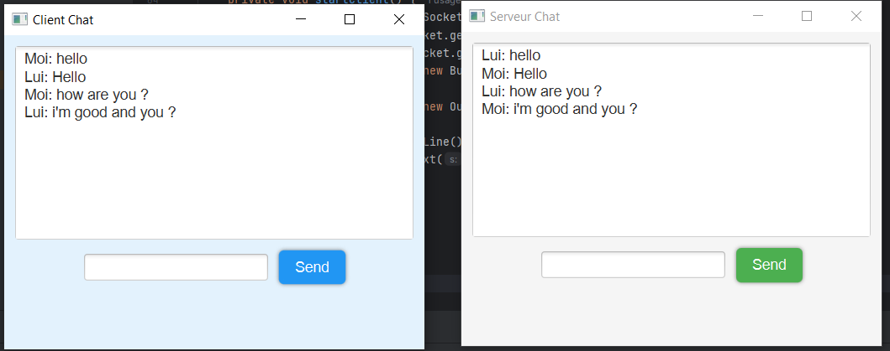
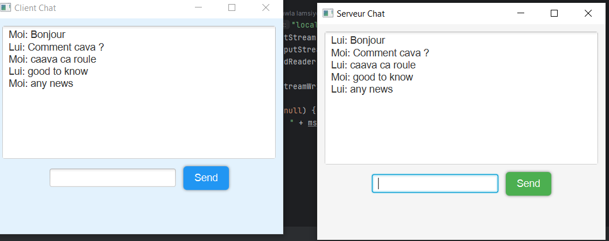

simple JavaFX-based chat application with a graphical user interface (GUI). The app consists of a Server and a Client communicating through Sockets.

🛠 ***Features***
✅ Graphical Interface with JavaFX
✅ Two-way communication between Server and Client
✅ Stylish UI using CSS (custom buttons, fonts, and colors)
✅ Real-time messaging with threaded communication

📜 ***How It Works***
Run the Server (Serveur.java)
Run the Client (Client.java)
Chat in real-time between the two applications

Here is a screenshot of the app 

